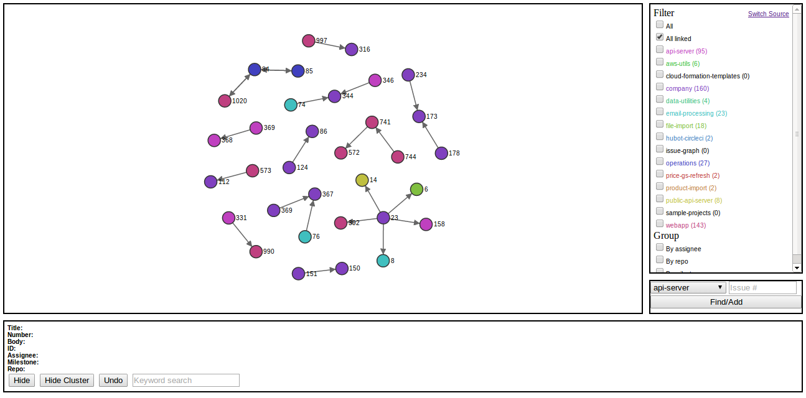
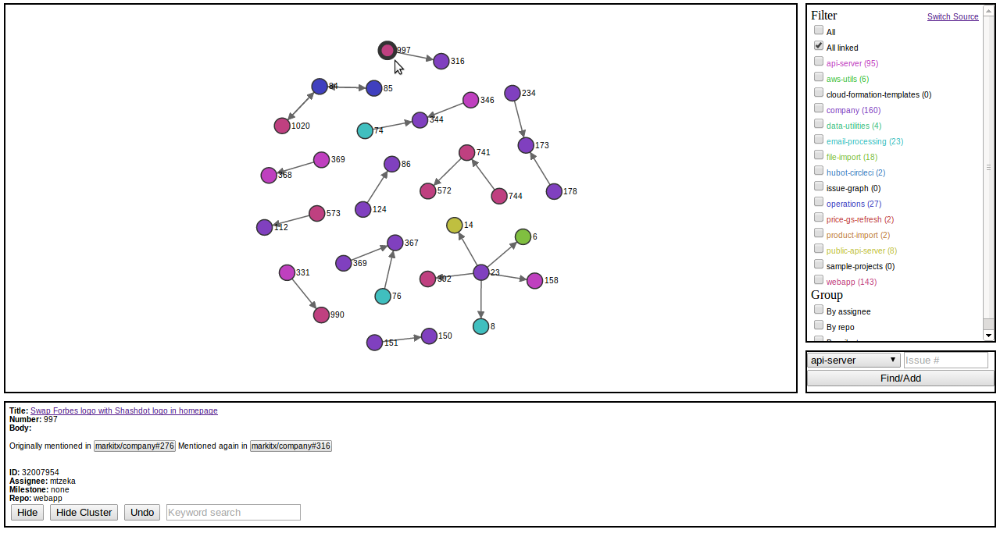
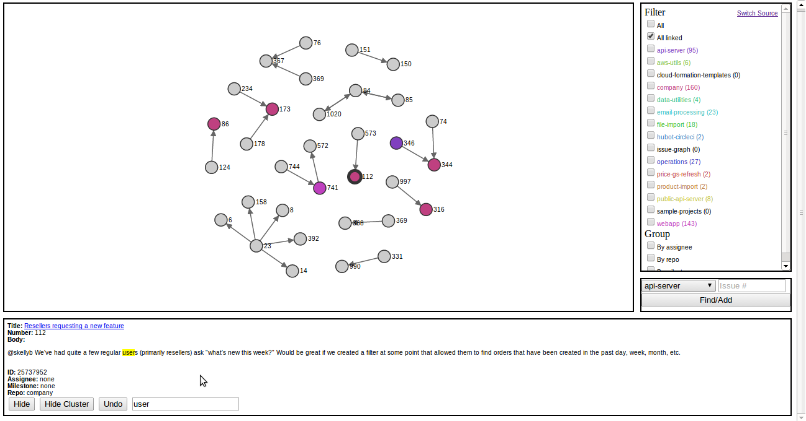

issue-graph
===========

A graphical view of the relationships between github issues 

GitHub is awesome for tracking issues related to repositories. It even lets you easily reference issues across repos. But once you've grown to many repos, it can become very hard to see the overall map of dependencies between issues across projects. The goal of this Issue-Graph application is to make it possible to see at a glance how issues are related throughout an organization's or user's repos.

Starting an internship earlier this year at [MarkITx](https://www.markitx.com/), I was given this basic premise and tasked with implementing it (using [d3](http://d3js.org/) and [node](http://nodejs.org/)) and making it my own.  Though not nearly finished, I do believe it can benefit from outside suggestions.  I just finished my first year at the University of Chicago and this is my first major dev project so I welcome any constructive recommendations.

My vision for this application is to become a tool to visualize the workflow and goals of an organization through their company repos and issues.  An employee of a company would be able to visually identify each issue's dependencies, specifically which issues are integral to the closing of many other issues.  

I focused on implementing features, such as filtering, hiding, and grouping, that would allow a user to customize their graph to aid their visualization of a group of repos.  

Details
-------
Issues nodes are linked by references within an issue's body to another issue using the format [org/repo]#issuenum.

Features
--------
* Select source of graph
    * Select between User repos, Organization repos, or public repos
* Color
    * Issue nodes colored by Repo
* Auto zoom
    * Graph automatically resizes to fit all issue nodes
* Click Nodes
    * Click nodes to dispay issue data and options to hide issue or cluster
    * Clicked nodes are indicated by a thick outline

* Add/hide
    * Buttons to hide clicked issue nodes or clusters
    * Add specific issue nodes
* Undo
    * Undo hidden issue nodes and clusters
* Grouping
    * Group issues by Assignee, Repo, or Milestone
    * Hide groups by clicking group (can be undo'd)

* Filtering
    * Options on sidebar to filter the issue nodes by repo
* Keyword Search Bar
    * Greys out issue nodes not containing keyword in Title or Body
    * Highlights keywords in issue data

Installation
------------
$ npm install

$ /bin/graph-server
